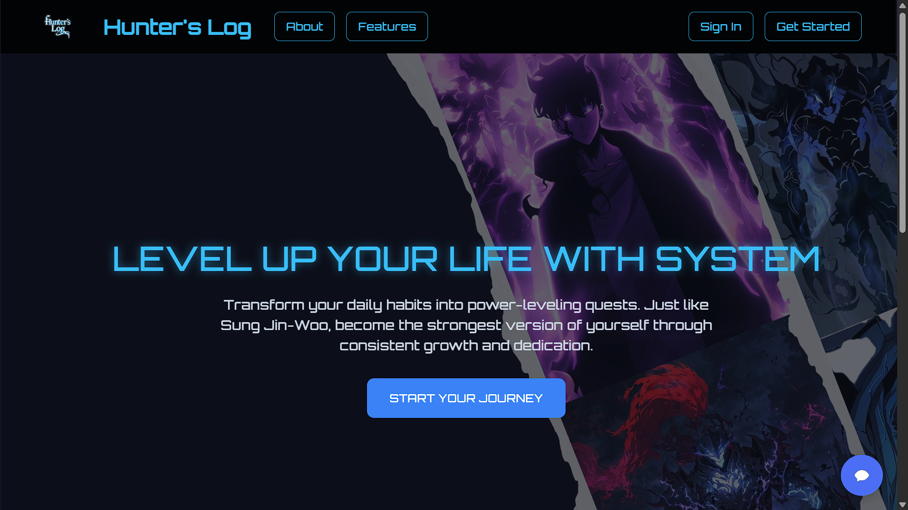
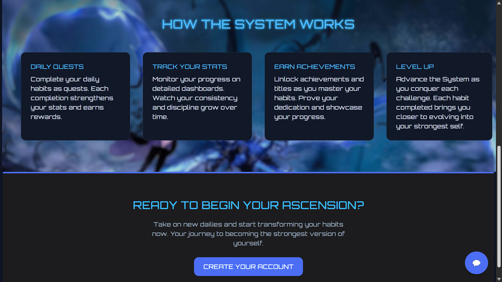
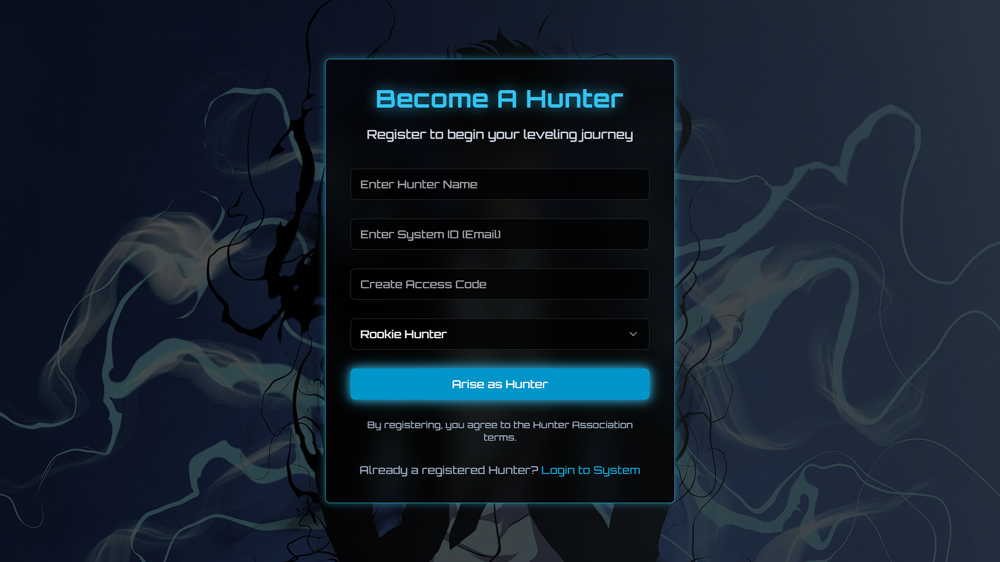
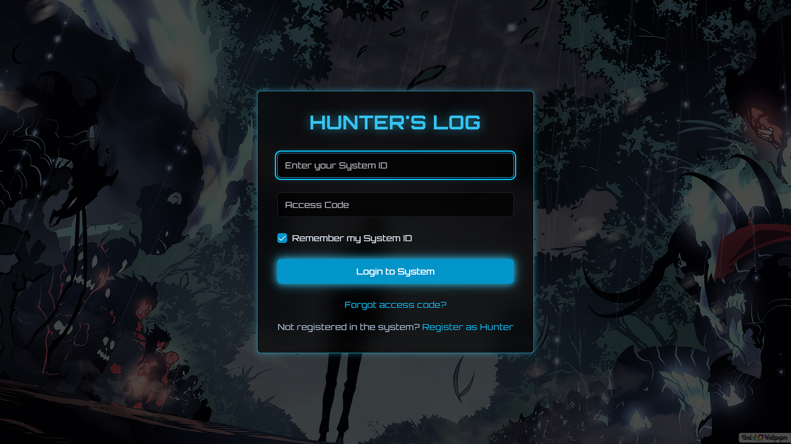
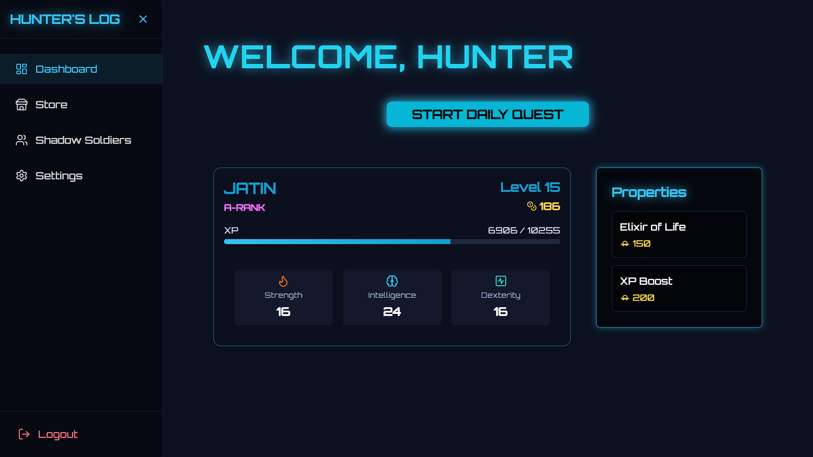
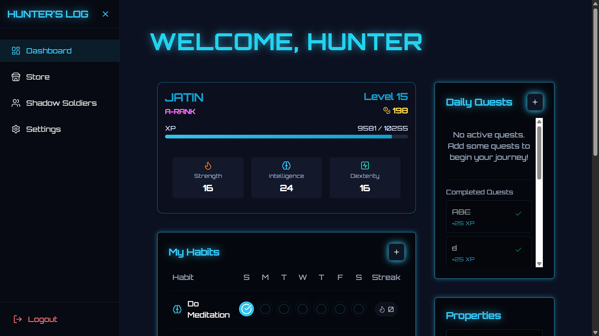
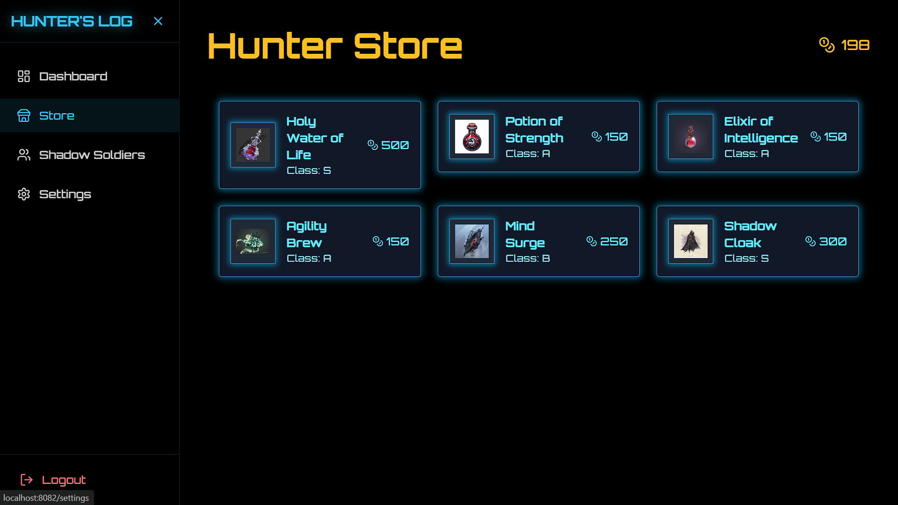
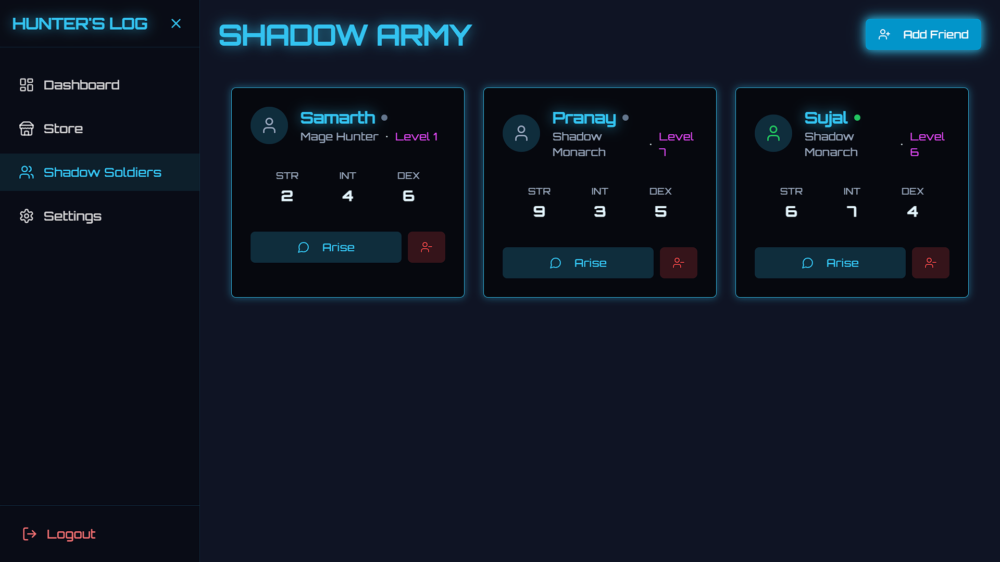
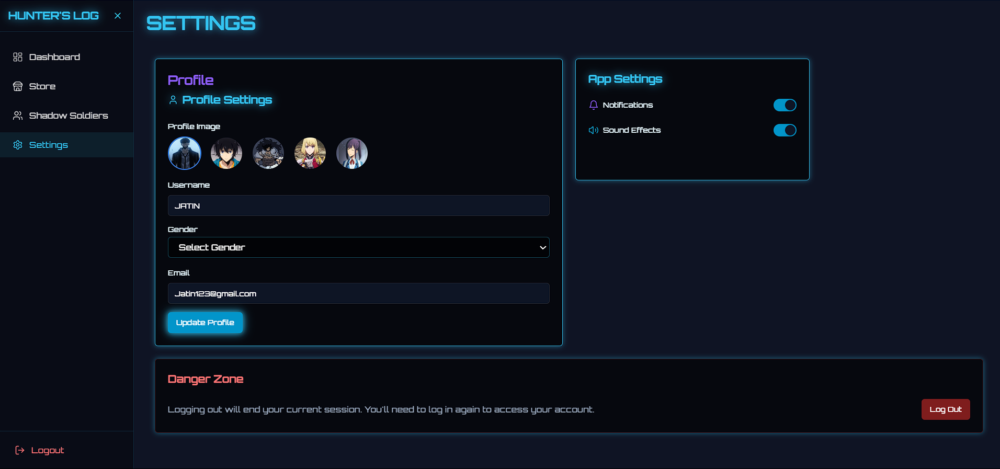

# 🚀 Hunter's Log: A Gamified and Personalized Habit Tracker

> Level Up Your Life In Hunter's Style.

---

## 📌 Problem Statement

**Problem Statement 9 – Build the Ultimate Digital Habit Builder**

---

## 🎯 Objective

- Imagine turning your everyday struggles into epic wins, just like the journey of a hunter who started from the bottom and rose to greatness.

- Hunter’sLog is a digital habit builder inspired by the spirit of Solo Leveling, helping individuals track habits, fight daily challenges, evolve with consistency, and become the best version of themselves.

- Hunter’s Log is designed for individuals who seek growth but often lose motivation.
By blending gamification, goal-setting, and personal growth tracking, we ensure users don't just build habits, they build themselves. Just like leveling up in an RPG.

---

## 🧠 Team & Approach

### Team Name:  
`CS-Nerds.dev`

### Team Members:  
- **[Jatin Vishwakarma](https://github.com/coddingjatin)**
- **[Samarth Mane](https://github.com/SamarthMane09)** 
- **[Sujal Lokhande](https://github.com/sujal-cs)** 
- **[Pranay Durutkar](https://github.com/Pranay2818)**

### Your Approach:  
- **Problem Statement Selection:**
--> We chose this because we felt the traditional apps lacked excitement. Habits should feel like achievements, not chores.

- **Key Challenges Addressed:**

1. How to keep users engaged daily?

2. How to balance fun without making it feel childish?

3. How to design for different user types, minimalists and RPG lovers both?

- **Breakthrough:**
  
✅ The concept of Shadow Soldier and Store brought the real "Hunter" feeling into a habit app, a motivating system that rewards users like a real RPG.

---

## 🛠️ Tech Stack

### Core Technologies Used:
- **Frontend:** React.js + TypeScript + Vite

- **UI Library:** Shadcn UI (built on Tailwind CSS)

- **State Management:** React Hooks (useState, useEffect)

- **Storage:** LocalStorage (Browser Storage API)

### Sponsor Technologies Used (if any):
- [❌] **Groq:** _How you used Groq_  
- [❌] **Monad:** _Your blockchain implementation_  
- [❌] **Fluvio:** _Real-time data handling_  
- [❌] **Base:** _AgentKit / OnchainKit / Smart Wallet usage_  
- [❌] **Screenpipe:** _Screen-based analytics or workflows_  
- [❌] **Stellar:** _Payments, identity, or token usage_
*(Mark with ✅ if completed)*
---

## ✨ Key Features

- ✅ **Create Daily Habits:** Quick add, edit, delete, and track habits.

- ✅ **Level Progression System:** Visual level-ups based on your consistency streak.

- ✅ **Store Achievements Locally:** No backend, no data leaks, your data, your journey.

- ✅ **Dark Mode Support:** Because even Hunters need to operate in the shadows.

- ✅ **Responsive Design:** Seamless across devices, mobile, tablet, desktop.

- ✅ **Motivational Animations:** Celebrate victories with dynamic UI transitions

- ✅ **In-App Store:** Purchase items/upgrades using earned XP.

- ✅ **Leveling System:** Progression like RPG games.

- ✅ **Training Log:** Detailed progress and reflections.

- ✅ **Minimal yet Powerful UI:** Responsive and gamified experience.

## Screenshots 
<p align="center">
   
  
</p>
<p align="center">
   
  
</p>
<p align="center">
   
  
</p>
<p align="center">
   
  
</p>
<p align="center">
   
</p>


---

## 📽️ Demo & Deliverables

- **Demo Video Link:** [Paste YouTube or Loom link here]  
- **PPT Link:** ( https://drive.google.com/file/d/1SACw7HZ3lOBTvsjPXjzRHix22ompruI9/view?usp=sharing )

- (We have attached project screenshots and a detailed PPT explaining flow, UI, and future roadmap.)
---

## ✅ Tasks & Bonus Checklist

- [✅] **All members of the team completed the mandatory task - Followed at least 2 of our social channels and filled the form** (Details in Participant Manual)  
- [✅] **All members of the team completed Bonus Task 1 - Sharing of Badges and filled the form (2 points)**  (Details in Participant Manual)
- [✅] **All members of the team completed Bonus Task 2 - Signing up for Sprint.dev and filled the form (3 points)**  (Details in Participant Manual)

*(Mark with ✅ if completed)*

---

## 🧪 How to Run the Project

### Requirements:
- Node.js (v18+)

- Vite (comes with project)

### Local Setup:
```bash
# Clone the repo
git clone https://github.com/coddingjatin/Hunters-Log-hackhazards25.git

# Install dependencies
cd Hunters-Log-hackhazards25
npm install

# Start development server
npm run dev
```

---

## 🧬 Future Scope

- 📈 **Integration with cloud database** for cross-device sync.

- 🛡️ **Adding AI-driven habit suggestions** and motivational nudges.

- 🌐 **Localization:** Multilingual support to serve global audiences.

- 🧩 **New Gameplay Elements:** Boss battles, daily quests, and more upgrades.

---

## 📎 Resources / Credits

- **Inspiration:** Inspired by "Solo Leveling" and gaming UX patterns.

- **Open Source:**

1. Shadcn/UI for modern components

2. TailwindCSS for fast, responsive design

- **Special thanks: Organizers and mentors who provided insights during hackathon. ✨**

---

## 🏁 Final Words

- Participating in this hackathon was an incredible journey of creativity, challenges, and constant learning.
With Hunter's Habit Log, we set out to craft not just another habit tracker, but an immersive experience inspired by the spirit of hunters — relentless, focused, and always evolving.

- Throughout this journey, we embraced rapid brainstorming, design iterations, technical hurdles, and last-minute pivots, but the vision stayed strong:
Help users "Train like a Hunter and Level Up like Jin-Woo" in real life.

- Building with React, TypeScript, Vite, and localStorage made us focus on delivering a blazing-fast, lightweight, and responsive product, while the Solo Leveling theme added a layer of motivation that traditional habit apps miss.

> Here's to every hunter out there. May your journey be relentless, your victories legendary, Great habits build great hunters.🚀
---
